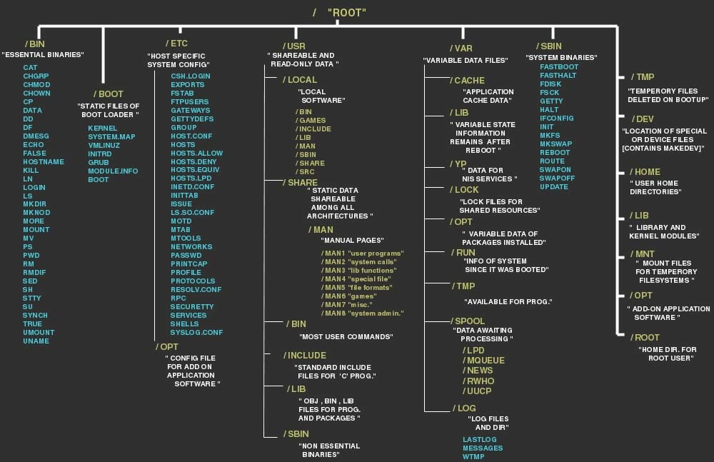

# Linux - File System Hierarchy

## Linux File System Hierarchy Content types

#### These are the major types of content stored in a Linux filesystem.
1. **Persistent** – These are the contents which should be persistent after a reboot, e.g system and applications configuration settings.
2. **Runtime** – Content generated by a running process; usually deleted by a reboot
3. **Variable / Dynamic** – These content may be appended or modified by processes running in the Linux system.
4. **Static content** – This remains unchanged until explicitly edited or reconfigured.

The Linux file system is made up of number of directories. Some of the more interesting ones are:

<table>
<tr>
<th>Directory</th>
<th>Contains</th>
</tr>

<tr>
<td>/bin</td>
<td>Contains common Linux user commands, such as ls, sort, date, and chmod.</td>
</tr>

<tr>
<td>/boot</td>
<td>Has the bootable Linux kernel and boot loader configuration files (GRUB).</td>
</tr>

<tr>
<td>/dev</td>
<td>Contains files representing access points to devices on your systems. These
include terminal devices (tty*), floppy disks (fd*), hard disks (hd*), RAM (ram*), and
CD-ROM (cd*). (Users typically access these devices directly through the device files.)</td>
</tr>

<tr>
<td>/etc</td>
<td>Contains administrative configuration files.</td>
</tr>

<tr>
<td>/home</td>
<td>Contains directories assigned to each user with a login account (with the
exception of root which has /root as their home directory).</td>
</tr>

<tr>
<td>/media</td>
<td>Provides a standard location for mounting and automounting devices, such
as remote file systems and removable media (with directory names of cdrecorder,
floppy, and so on).</td>
</tr>

<tr>
<td>/mnt</td>
<td>A common mount point for many devices before it was supplanted by the stan-
dard /media directory. Some bootable Linux systems still used this directory to mount
hard disk partitions and remote file systems.</td>
</tr>

<tr>
<td>/opt</td>
<td>Optional application packages. In some distros high beasts od software such as LibreOffice or KDE live here.</td>
</tr>

<tr>
<td>/proc</td>
<td>Contains information about system resources.</td>
</tr>

<tr>
<td>/root</td>
<td>Represents the root user’s home directory. The home directory for root does
not reside beneath /home for security reasons.</td>
</tr>

<tr>
<td>/sbin</td>
<td>Contains administrative commands and daemon processes.</td>
</tr>

<tr>
<td>/sys</td>
<td>A /proc-like file system, new in the Linux 2.6 kernel and intended to contain
files for getting hardware status and reflecting the system’s device tree as it is seen by the
kernel. It pulls many of its functions from /proc.</td>
</tr>

<tr>
<td>/tmp</td>
<td>Contains temporary files used by applications.</td>
</tr>

<tr>
<td>/usr</td>
<td>Contains user documentation, games, graphical files (X11), libraries (lib), and a
variety of other user and administrative commands and files.</td>
</tr>

<tr>
<td>/var</td>
<td>Contains directories of data used by various applications. In particular, this is
where you would place files that you share as an FTP server (/var/ftp) or a Web server
(/var/www). It also contains all system log files (/var/log) and spool files in /var/
spool (such as mail, cups, and news).</td>
</tr>

</table>

