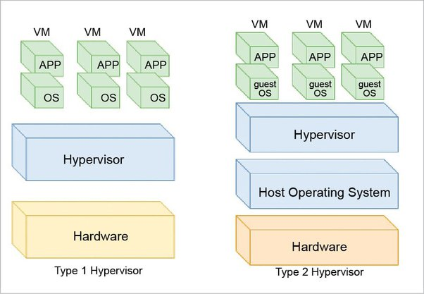
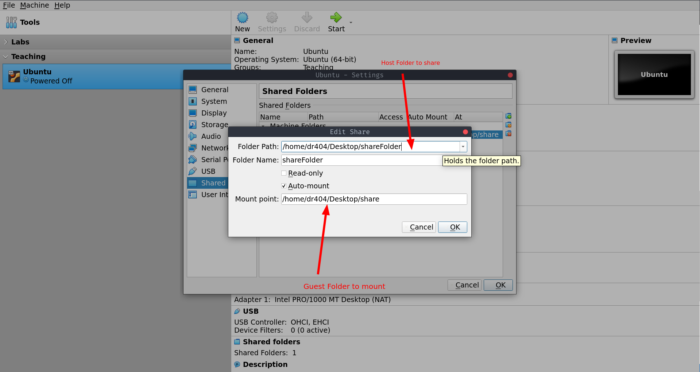

<h1 align="center">Virtualization</h1> 

#### Type 1 Hypervisor

- referred to `bare-metal`
- run directly on physical hardware
- no other Operating Systems and device drivers to content with
- best performance
- eg `Microsoft Hyper-V`, `Qubes OS`

#### Type 2 Hypervisor

- installed on an existing operation system 
- relies on host mechine's OS 
- eg `Oracel virtualbox`, `VM ware Workstation`

## V Box Setting

#### Share Folder with Host

1. openVBox and go to `setting > share folder`

2. Install `nautilus-admin`

