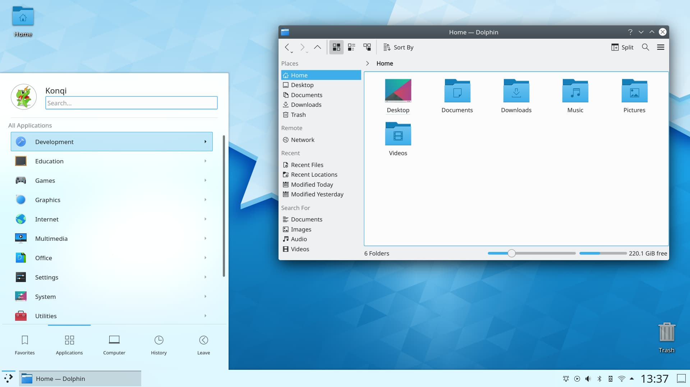

# Linux Desktop Environment

```
A Desktop environment is the bundle of components that provided your common graphical user interface (GUI) elements
eg. icon, toolbars, wallpaper, desktop widgets
```

## 1.Gnome (GNU Network Object Model Environment)

1. Most use
2. modern look , GNOME shell Extensions
3. app is well-organized and simple to use.
4. use plenty of resources
<br>


## 2. KDE Plasma

1. Second Most use
2. Highly customize, Flexible, user-friendly
3. Moderate usage of system resource
<br>




## LXDE (Lightweight X11 Desktop Environment)

1. most suitable for cloud workstation, netbooks and outdated hardware
2. Faster, Lighter
3. Low consumption of RAM
<br>


## XFCE 

1. most performance-oriented desktop environment
2. fast, portable, resource efficient
3. simple and light weight
<br>

