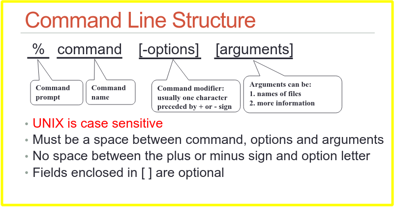
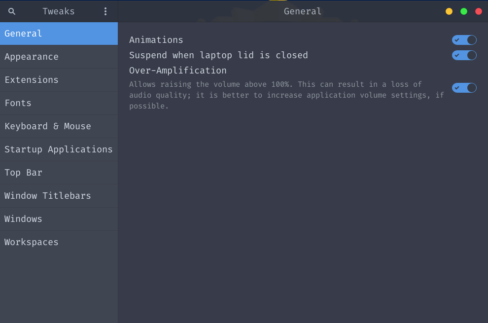
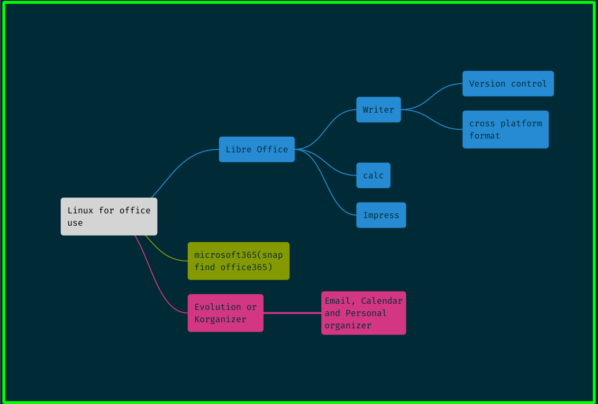

# Basic Command Structure




# Two Type of Software Installation

## 1. Repository 


 a repository is a location from where the Linux system retrieves and installs updates and applications related to the Operating system. The repository is nothing, but a collection of software, and this collection is hosted on a remote server and is downloaded and installed for either installing or updating software packages on the Linux system


- APT (Advanced Package Tool)
- thousands of program
- High level of security
- compatibility is tested

#### How to install

```sudo apt install gnome-tweaks```


## Stores (Like play-store)

- not very secure
- a lot of unofficial application

#### How to install

```snap install telegram-desktop```

# Gnome Tweaks

- use to customize gnome desktop



# Gnome Extenstion

## File Path for stored extenstion

`/home/$USER/.local/share/gnome-shell/extensions`


1. Create Extensions Folder
2. User Firefox Browser and go to `https://extensions.gnome.org`
3. Register account
4. add browser extension
5. Install extension

## Best Gnome Extension

1. Flotaing Dork or Dash to Dock
2. Deskton icon NG (DING)


# Linux with GUI (Office and Personal use)




