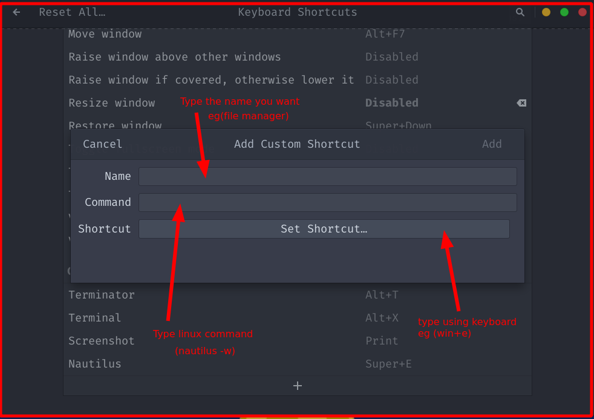

<h1 align="center">Font and Keybard Installation</h1>

# Key Board Install

- go to ```setting > Keyboard > Input Source```

# Font Install

- go to `https://unicodetoday.org/fonts/`
- donwload `.ttf` font
- move the font to `/usr/share/fonts/truetype`
- update font cache
    - `fc-cache -f -v`


<h1 align="center">Shortcut Creation </h1>

1. go to ```setting > keyboard > View and Customize shortcut```
2. got to `custom shortcut`
3. press shortcut key on keyboard



## File Manager 

`nautilus` File manager

#### open file manager in command line

`nautilus -w`

```
nautilus    = file manager command
w           = new window
```

## Terminal

`gnome-terminal` 
