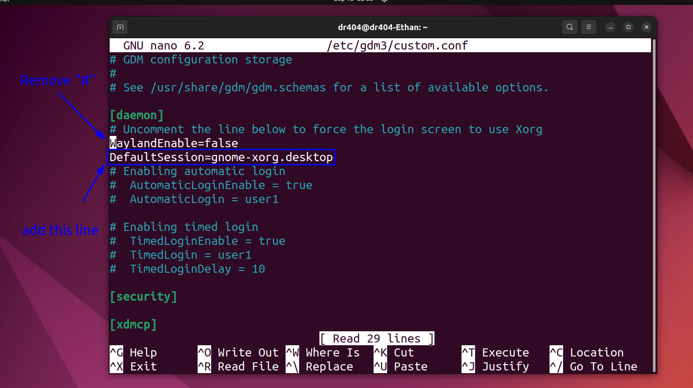

# Flame shot error fix


### 1. Open /etc/gdm3/custom.conf with `nano`

`sudo nano /etc/gdm3/custom.conf`

### 2. Remove "#" from WaylanEnable=flase



### 3. Add the following line to the [daemon] section:

```
DefaultSession=gnome-xorg.desktop
```
### 4. Save config file with `ctrl + x` and Type `y` and `Enter`

#### 5. Reboot computer


