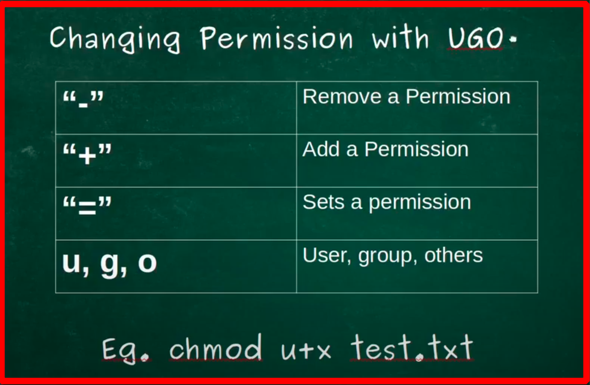
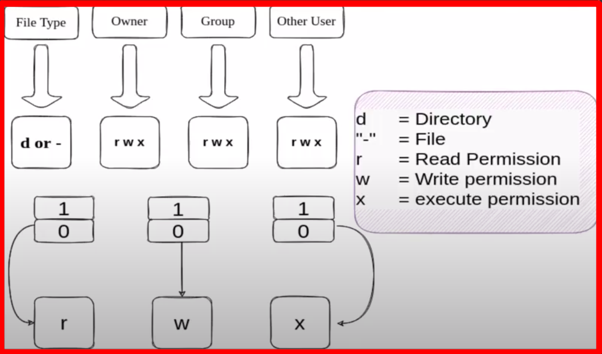
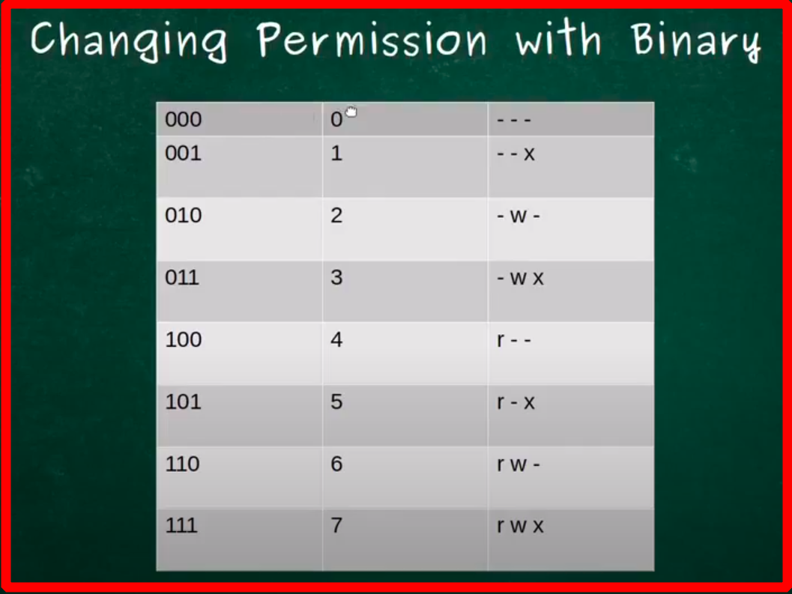

# Permission Management

## Type of Permission

1. Read permission `-r`
2. Write Permission `-w`
3. Execute Permission `-x`

`The owner of the file cand grant permission`

## Finding file owner

- `ls -l` command show what user belong to and what group belong to file

- `ls -sl` also show permission of `user`, `group`, and `others`

## Change Permission of file with `chmod`

#### adding permission with `+`

- `chmod +x file.txt`

#### removing permission with `-`

- `chmod -x file.txt`

## Changing Ownership of a file with `chown`

- `chown user file`
- eg `sudo chown test file.txt`


# Changing Permission with UGO



- eg `sudo chmod u+x file.txt`


# Changing Permission with BINARY METHOD



- `d`   =   directory
- `-`   =   file

## Binary - to - Decimal

1 1 1 = 1x2<sup>2</sup> +  1x2<sup>1</sup> + 1x2<sup>0</sup>


## Permission Table




#### Example 

`chmod 744 file.txt`

```
owner   = 7 (rwx)  
group   = 4 (r--)
others  = 4 (r--)
```
