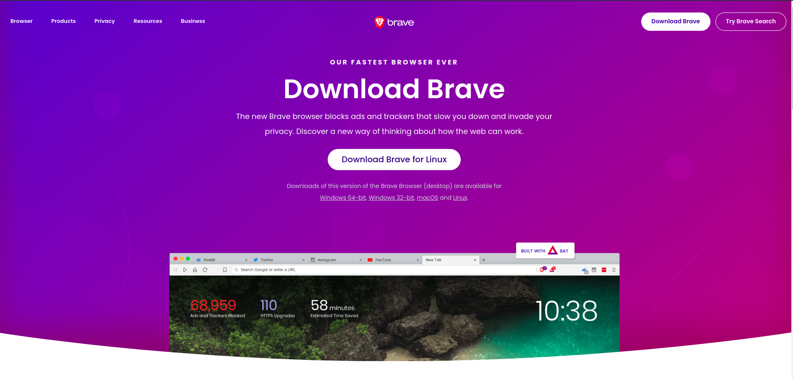
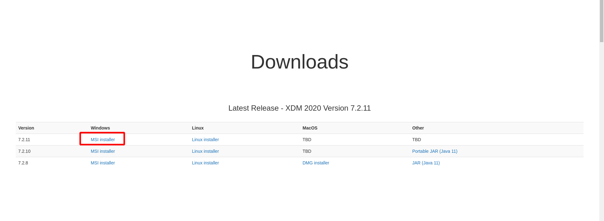
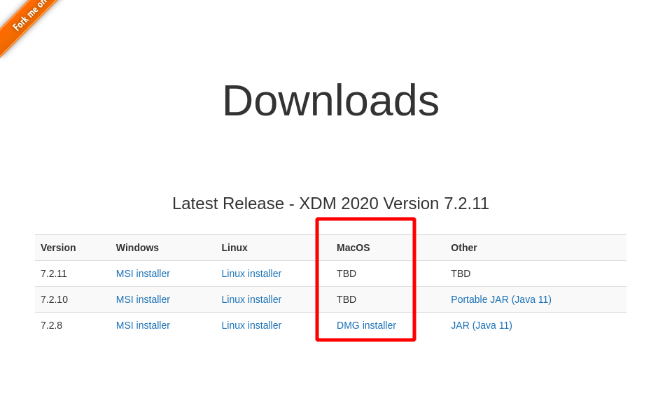
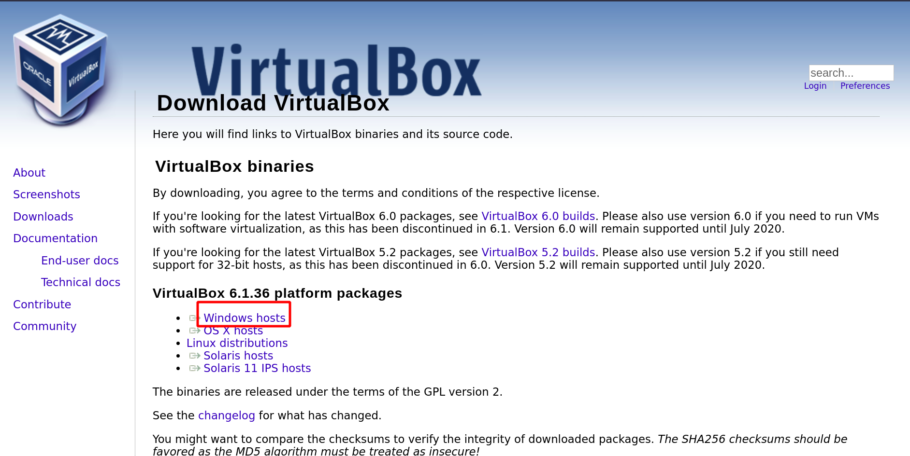
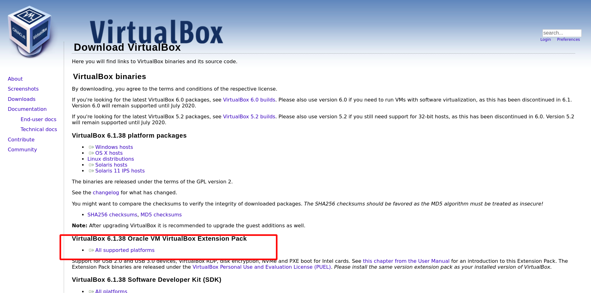
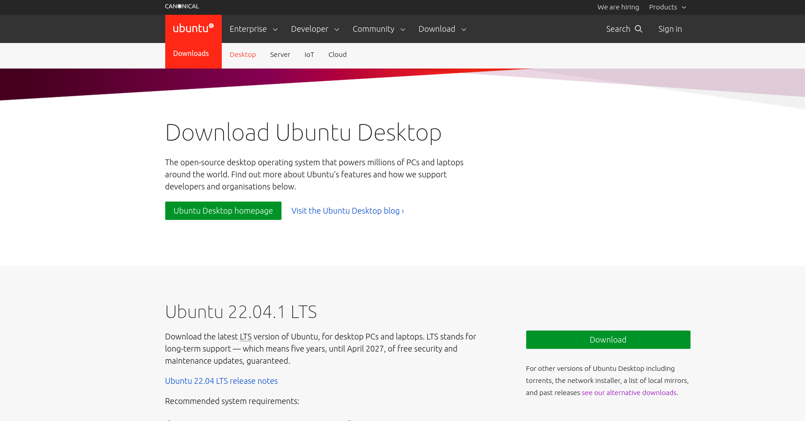

# Resource Download


## 1. Brave Browser Download

```
Brave browser has many fancy feature and privacy focused
```
- visit and download at [brave](https://brave.com/download/) website




`For mac ==> Brave က ကိုယ့် Operation ကို detect လုပ်နိုင်တာကြောင့် ဒီ Link ကနေ တန်း Download လုပ်လို့ရပါတယ်`


## 2. XDM download manager download

- visit and download at [xdm](https://xtremedownloadmanager.com/) website
- Add Browser Extension



#### FOR MAC



`Direct XDM Download Link ForMac` ==> [xdm_for_MAC](https://sourceforge.net/projects/xdman/files/XDMSetup.dmg/download)


## 3. Virtualbox Download

1. Visit [virutalbox Website](https://www.virtualbox.org/wiki/Downloads)



`Direct download link for Mac` ==> [vbox_for_Mac](https://download.virtualbox.org/virtualbox/6.1.38/VirtualBox-6.1.38-153438-OSX.dmg)

```
Virutal box မှာ Function တွေအကုန် အလုပ်လုပ်နိုင်ဖို့ extension pack ထည့်သွင်းဖို့ လိုပါတယ်။ Extension Pack ကိုလည်း အပေါ်ကလင့် ထဲမှာပါ download လုပ်နိုင်ပါတယ်။ window, Mac, Linux အကုန်တူတူပဲ download လုပ်နိုင်ပါတယ်
```


Direct Download Link ==> [expension_pack](https://download.virtualbox.org/virtualbox/6.1.38/Oracle_VM_VirtualBox_Extension_Pack-6.1.38.vbox-extpack)


## 3. Ubuntu ISO download (optical disc image)

1. Visit and download at [ubuntu](https://ubuntu.com/download/desktop) website



`Ubuntu ISO ကတော့ ဘယ် OS ဖြစ်ဖြစ်တူတူဖြစ်တာမို့ ဒီ Link ကနေ ပဲ ရှာ Download လုပ်လို့ရပါတယ်`


## 4. Discord Download

For Mac ==> https://discord.com/api/download?platform=osx

