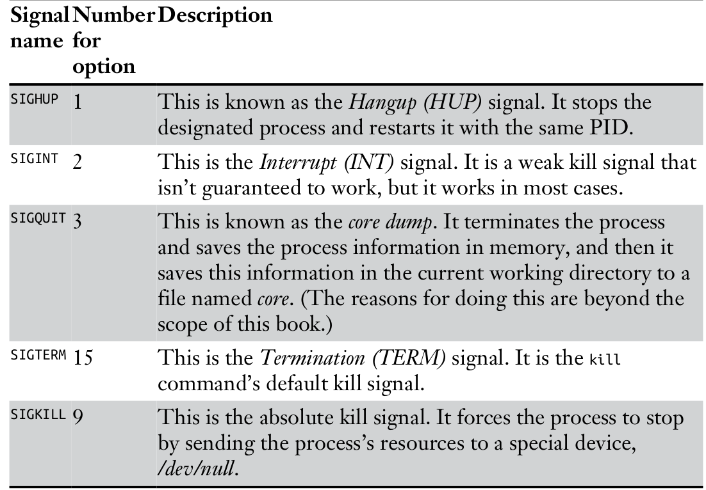

# Process Mangement

- A process is simpley a program that's running and using resources.

- eg. Terminal, Web Server, running command and database


## 1. Viewing Process with `ps` command

- `ps` command without any option linst `process started by user after current login`

#### `ps aux` command
- show all process runing on the system for all user

#### `ps` command output

```
USER    =   Ther user who invoke the process
PID     =   The process ID
%CPU    =   The CUP usage percentage
%MEM    =   The Memory Usage Percentage
COMMAND =   The name of the command that started the process

```

## 2. Filtering by Process Name

- first started `msfconsole`
- `ps aux | grep msfconsole`

## 3. Fining the greediest process with `top` command

- `h` or `?`  show a list of interactive command
- `q` quit `top`

# Managing process

## 1. Changing process priority with `nice`

#### nice value range 

- ` -20 to +19 ` 
-  Low nice value mean `High priority`
- ` The owner of the process can lower the priority of the process but cannot increase its priority. Of course, the superuser or root user can arbitrarily set the nice value to whatever they please.`

## 2. Setting the Priority When Starting a Process

`nice -n -10 /bin/nmap`

- nice value `-10` increst `priority and allocating more resources`


## 3. Killing Processes with `kill` command

-  a process will consume way too many system resources, exhibit
unusual behavior, or—at worst—freeze. A process that exhibits this type of behavior is often referred to as a zombie process

- The kill command has 64 different kill signals, and each does something slightly different

#### the systex for `kill` command

- `kill-signal PID`



- `kill -1 PID`
- `kill -9 PID`

#### `killall` command
- u don’t know a process’s PID, you can use the killall command to
kill the process. This command takes the name of the process, instead of the PID, as an argument.

- `killall -9 nameofprocess`

## 4. Running process in the background

- `subl newfile &`

## 5. Moving a process to the foreground

`fg PID` 


