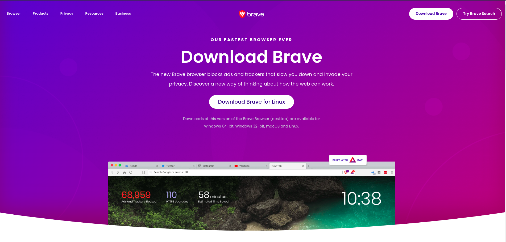
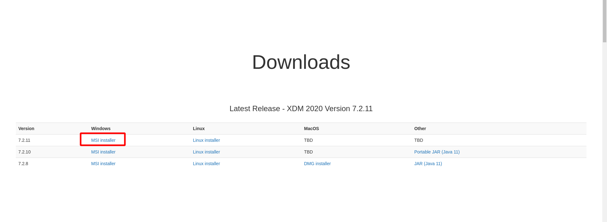
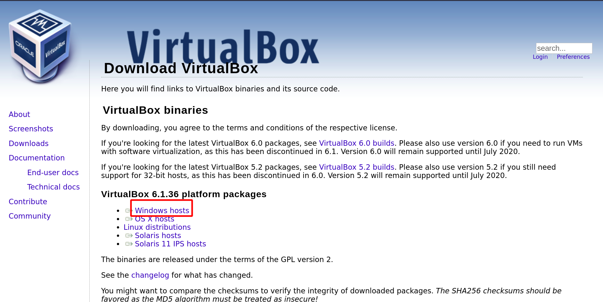
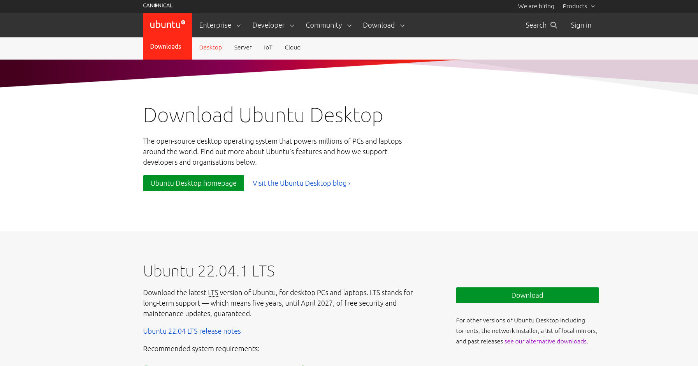

# Resource Download


## 1. Brave Browser Download

```
Brave browser has many fancy feature and privacy focused
```
- visit and download at [brave](https://brave.com/download/) website





## 2. XDM download manager download

- visit and download at [xdm](https://xtremedownloadmanager.com/) website
- Add Browser Extension




## 3. Virtualbox Download

1. Visit [virutalbox Website](https://www.virtualbox.org/wiki/Downloads)




## 3. Ubuntu ISO download (optical disc image)

1. Visit and download at [ubuntu](https://ubuntu.com/download/desktop) website

